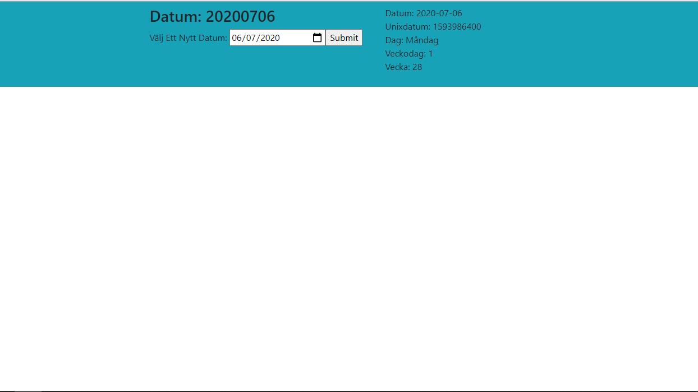

## Test code on every react life cycle methods:

 #### ComponentDidMount():
 ##### This method will hooks after constructure and the render method
 
 #### ComponentWillMount():
 ##### This method will hooks before any mounting
  
 3-componentWillReceiveProps()
 4-componentDidUpdate()
 5-shouldComponentUpdate()
 6-componentWillUpdate()
 7- componentWillUnmount()
 
 

